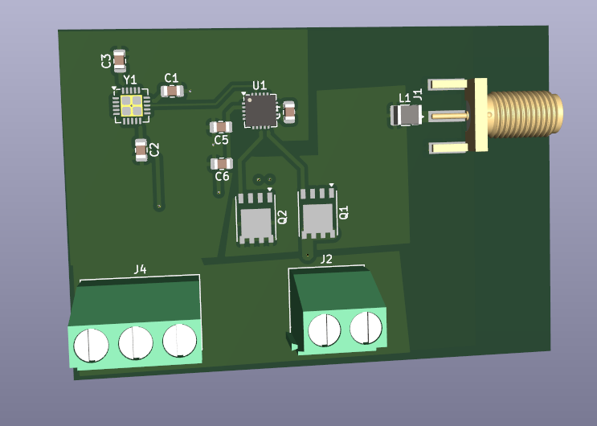
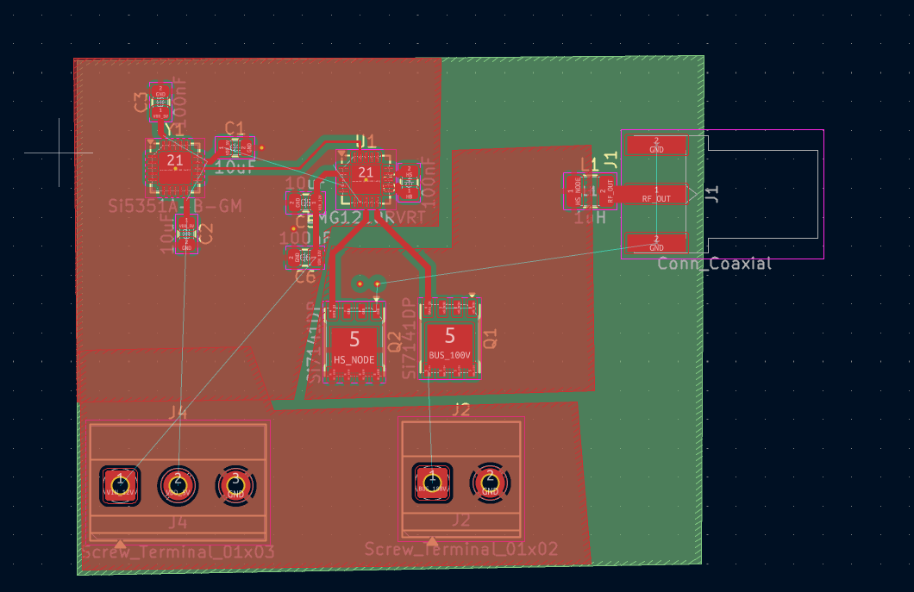
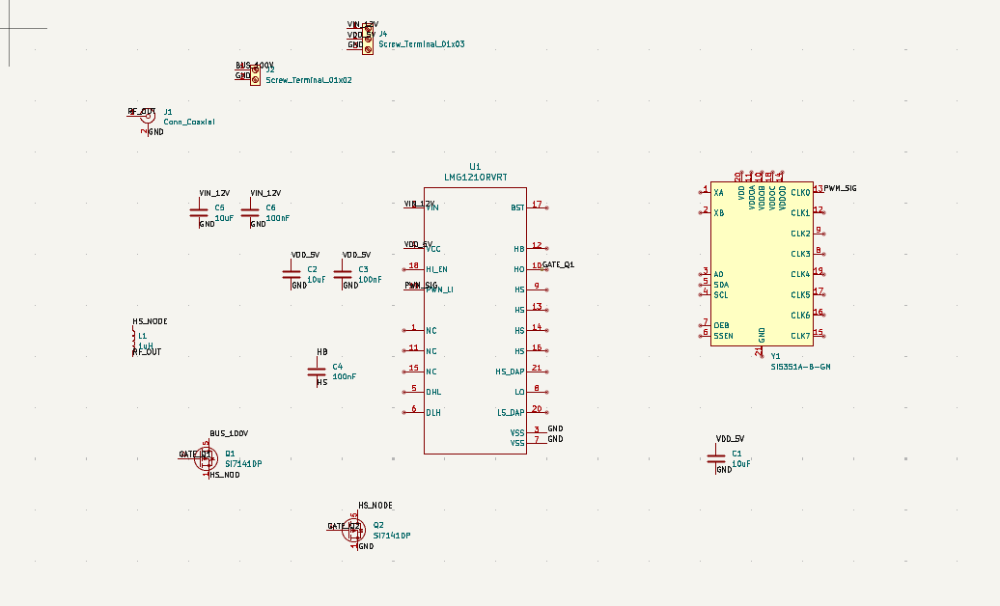
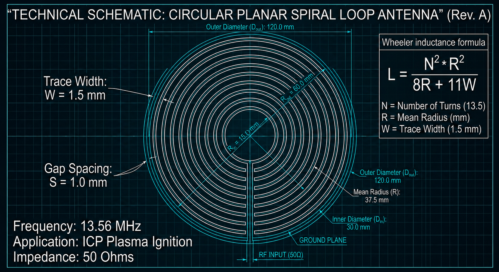
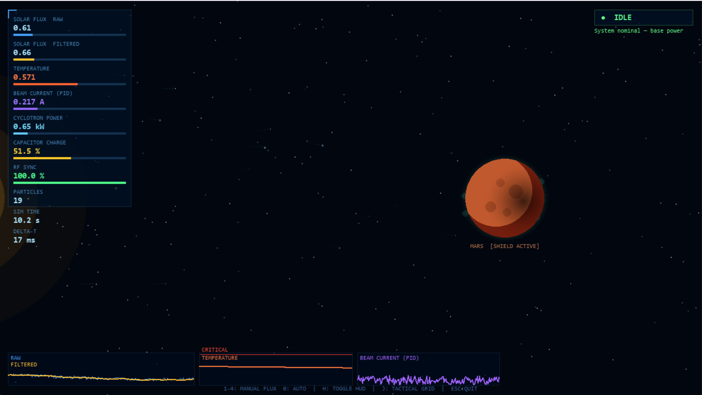
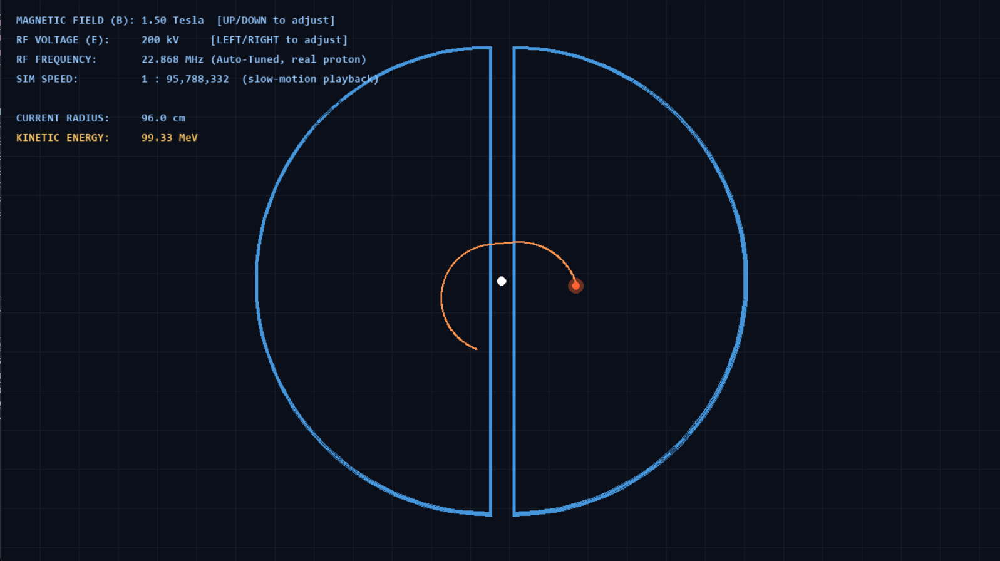

# Project Helios2

## Project Disclaimer & Purpose
This project is an engineering simulation created strictly for fun and entertainment. To be completely honest, no physical RF plasma generator has been manufactured, and this system is not intended for actual deployment. Everything presented here is a theoretical "what-if" scenario and a creative exercise in conceptual hardware design and software simulation. 

## Overview
Project Helios2 is a cyber-physical system (CPS) testbed designed to simulate a 13.56 MHz RF Plasma Generator for Inductively Coupled Plasma (ICP) applications. 

This repository contains the conceptual hardware design files for the high-power RF generator and the software source code for the simulation engine.

## Hardware Architecture (RF Power Stage)
The theoretical hardware component focuses on generating high voltage switching power while maintaining strict signal integrity and thermal management.

* **Switching Stage:** LMG1210 High-Speed GaN/MOSFET driver paired with Si7141DP power MOSFETs capable of handling 100V.
* **PCB Stack-up:** 4-layer FR-4 design. Power routing is buried in inner layers, and switching noise is shielded by a solid ground plane.
* **Thermal Management:** Extensive use of thermal vias under active components, utilizing the bottom layer as a massive passive heatsink.
* **Antenna Topology:** 50 Ohms impedance-matched Circular Planar Spiral Loop Antenna, designed to overcome the wavelength constraint of the 13.56 MHz ISM band.

### Hardware Visuals





## Software & Simulation
The software side consists of deterministic physics and visualization scripts running on Python and Pygame. **Please note that Artificial Intelligence was used to assist in writing and structuring the software code for this simulation.**

* **Autonomous Control:** A dynamic PID controller (Kp=0.55, Ki=0.08, Kd=0.12) adjusts the simulated RF Beam Current in real-time against chaotic solar flux data.
* **State Machine:** The system autonomously transitions between IDLE, STORM ALERT, OVERDRIVE, and CRITICAL FAILURE based on thermal limits and capacitor charge states.
* **Telemetry HUD:** Live data visualization for RF sync, cyclotron power, and system temperature.

### Simulation Visuals



## Repository Structure
The repository is organized into specific directories for hardware, software, and imagery. 

The hardware directory contains the KiCad project files, specifically `fp-info-cache`, `marssiklot.kicad_pcb`, `marssiklot.kicad_prl`, `marssiklot.kicad_pro`, and `marssiklot.kicad_sch`. 

The software directory contains the core simulation scripts, which include `cyclotrone.py`, `Helios2game.py`, and `Helios2simu.py`.

```text
Helios2/
├── Hardware/
│   ├── fp-info-cache
│   ├── marssiklot.kicad_pcb
│   ├── marssiklot.kicad_prl
│   ├── marssiklot.kicad_pro
│   └── marssiklot.kicad_sch
├── Images/
│   ├── Antenna.png
│   ├── CyclotroneSim.png
│   ├── Helios2_RF.png
│   ├── Helios2_RF_PCB.png
│   ├── SchemaHelios2.png
│   └── Sim_Screen.png
└── Software/
    ├── cyclotrone.py
    ├── Helios2game.py
    └── Helios2simu.py